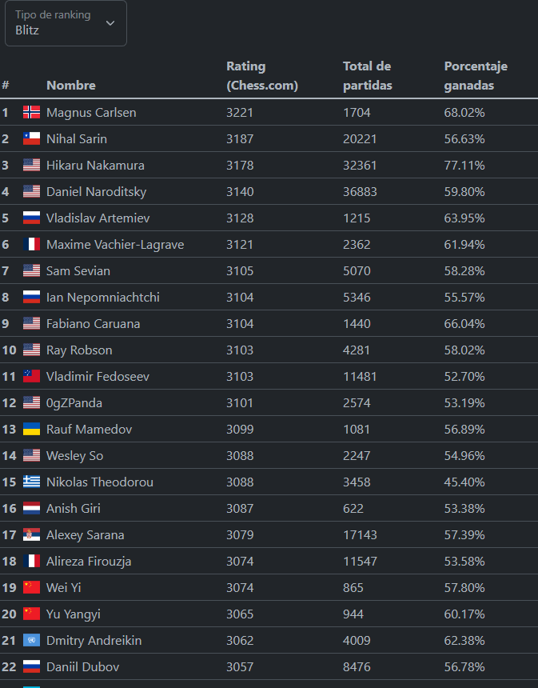
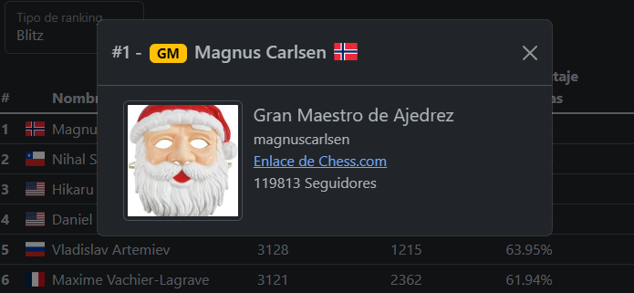
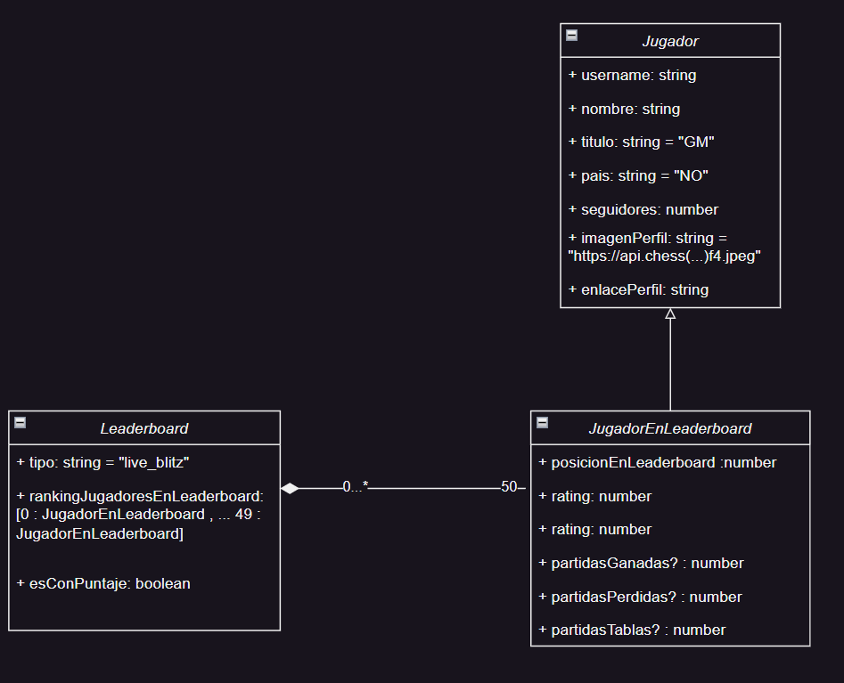

# chess-leaderboard
 simple leaderboard consumiendo la API de Chess.com

[Enlace a la documentación de la API](https://www.chess.com/news/view/published-data-api)

### Instrucciones
Descargar repositorio y hacer `npm run start` o ver [deploy en GH pages](https://jandreslami.github.io/chess-leaderboard/)

### Modelo entidad-relacion

### Todo
- [x] Cache con localstorage
- [x] Testing con Cypress
- [ ] Testing con Jest
- [ ] Placeholders para evitar layout shift al cargar
